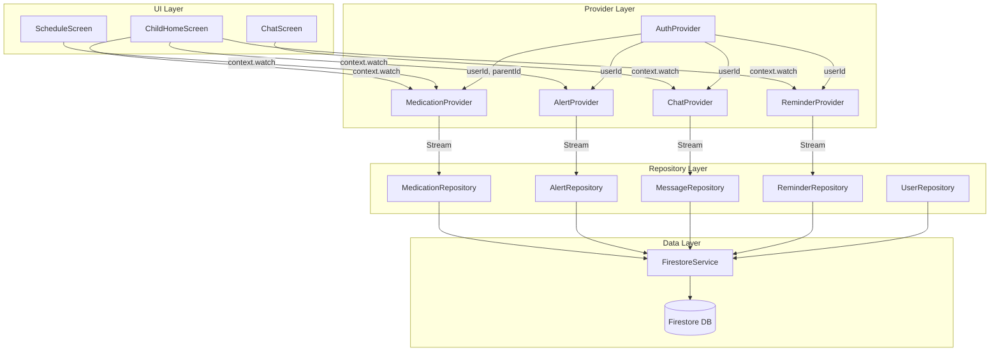

# Tài liệu Thiết kế: Firestore Data Layer

## Tổng quan

Feature này xây dựng tầng dữ liệu (data layer) hoàn chỉnh cho ứng dụng Flutter "An Tâm" theo kiến trúc phân lớp: **Models → Repositories → Providers → UI**. Mục tiêu là thay thế toàn bộ fake/mock data đang hardcode trong các màn hình bằng dữ liệu thật từ Firestore, đồng thời đảm bảo state management nhất quán thông qua Provider pattern.

Kiến trúc tuân theo nguyên tắc **Separation of Concerns**:
- **Models**: Chỉ biết về cấu trúc dữ liệu và serialization
- **Repositories**: Chỉ biết về Firestore, không biết về UI
- **Providers**: Cầu nối giữa Repository và UI, quản lý state
- **UI Screens**: Chỉ đọc từ Provider, không gọi Firestore trực tiếp

---

## Kiến trúc

### Sơ đồ luồng dữ liệu



### Cấu trúc thư mục

```
lib/src/
├── models/
│   ├── user_model.dart
│   ├── medication_model.dart
│   ├── check_in_model.dart
│   ├── alert_model.dart
│   ├── reminder_model.dart
│   ├── message_model.dart
│   └── family_link_model.dart
├── repositories/
│   ├── medication_repository.dart
│   ├── alert_repository.dart
│   ├── reminder_repository.dart
│   ├── message_repository.dart
│   └── user_repository.dart
├── providers/
│   ├── auth_provider.dart          ← đã có
│   ├── medication_provider.dart
│   ├── alert_provider.dart
│   ├── chat_provider.dart
│   └── reminder_provider.dart
└── services/
    ├── firebase_service.dart       ← đã có
    ├── firestore_service.dart      ← đã có
    └── auth_service.dart           ← đã có
```

### Quyết định thiết kế

1. **Giữ nguyên FirestoreService**: Các Repository sẽ sử dụng `FirebaseFirestore.instance` trực tiếp thay vì phụ thuộc vào `FirestoreService` hiện có, vì `FirestoreService` hiện tại có API không đủ linh hoạt cho các query phức tạp. `FirestoreService` vẫn được dùng trong `AuthProvider`.

2. **Stream-based state**: Tất cả dữ liệu real-time (medications, alerts, messages, reminders) đều dùng Firestore streams thay vì one-time fetch, đảm bảo UI luôn đồng bộ.

3. **ChangeNotifierProxyProvider**: Dùng để các Provider phụ thuộc vào `AuthProvider` tự động rebuild khi user đăng nhập/đăng xuất.

4. **Custom Exceptions**: Định nghĩa `PermissionDeniedException`, `UserNotFoundException`, `ValidationException` để xử lý lỗi có cấu trúc.

---

## Components và Interfaces

### Custom Exceptions

```dart
// lib/src/core/exceptions.dart
class PermissionDeniedException implements Exception {
  final String message;
  PermissionDeniedException([this.message = 'Không có quyền thực hiện thao tác này']);
}

class UserNotFoundException implements Exception {
  final String message;
  UserNotFoundException([this.message = 'Không tìm thấy người dùng']);
}

class ValidationException implements Exception {
  final String message;
  ValidationException(this.message);
}
```

### MedicationRepository Interface

```dart
abstract class IMedicationRepository {
  Future<String> createMedication(MedicationModel medication);
  Stream<List<MedicationModel>> getMedicationsForParent(String parentId);
  Future<void> updateMedication(String id, Map<String, dynamic> data);
  Future<void> deactivateMedication(String id);
  Future<void> createCheckIn(CheckInModel checkIn);
  Stream<List<CheckInModel>> getTodayCheckIns(String parentId);
}
```

### AlertRepository Interface

```dart
abstract class IAlertRepository {
  Stream<List<AlertModel>> getUnreadAlerts(String userId);
  Stream<int> getUnreadCount(String userId);
  Future<void> markAsRead(String alertId, String userId);
  Future<void> createAlert(AlertModel alert);
}
```

### ReminderRepository Interface

```dart
abstract class IReminderRepository {
  Stream<List<ReminderModel>> getRemindersForUser(String userId);
  Future<void> createReminder(ReminderModel reminder);
  Future<void> updateReminder(String id, String content);
  Future<void> deleteReminder(String id, String requestingUserId);
}
```

### MessageRepository Interface

```dart
abstract class IMessageRepository {
  Stream<List<MessageModel>> getMessages(String userId1, String userId2);
  Future<void> sendMessage(MessageModel message);
}
```

### UserRepository Interface

```dart
abstract class IUserRepository {
  Future<UserModel> getUserById(String userId);
  Future<UserModel> getLinkedParent(String childUserId);
  Future<void> createFamilyLink(FamilyLinkModel link);
  Future<void> acceptFamilyLink(String linkId, String childUserId);
  Stream<FamilyLinkModel?> getFamilyLinkForChild(String childId);
}
```

---

## Data Models

### UserModel

```dart
class UserModel {
  final String id;
  final String name;
  final String email;
  final String role;         // 'child' | 'parent'
  final String? parentId;
  final DateTime? createdAt;

  factory UserModel.fromFirestore(DocumentSnapshot doc);
  Map<String, dynamic> toMap();
}
```

**Firestore mapping:**
| Field | Dart type | Firestore type | Default |
|-------|-----------|----------------|---------|
| id | String | document ID | required |
| name | String | string | '' |
| email | String | string | '' |
| role | String | string | 'child' |
| parentId | String? | string | null |
| createdAt | DateTime? | timestamp | null |

### MedicationModel

```dart
class MedicationModel {
  final String id;
  final String parentId;
  final String childId;
  final String name;
  final String time;         // 'HH:mm' format
  final String frequency;    // 'daily' | 'weekly' | ...
  final int dosage;
  final bool isActive;
  final DateTime? createdAt;

  factory MedicationModel.fromFirestore(DocumentSnapshot doc);
  Map<String, dynamic> toMap();
}
```

### CheckInModel

```dart
class CheckInModel {
  final String id;
  final String medicationId;
  final String parentId;
  final String status;       // 'completed' | 'missed'
  final DateTime? timestamp;

  factory CheckInModel.fromFirestore(DocumentSnapshot doc);
  Map<String, dynamic> toMap();
}
```

### AlertModel

```dart
class AlertModel {
  final String id;
  final String userId;
  final String type;         // 'sos' | 'missed_medication' | 'reminder'
  final String title;
  final String message;
  final bool isRead;
  final DateTime? timestamp;
  final DateTime? readAt;

  factory AlertModel.fromFirestore(DocumentSnapshot doc);
  Map<String, dynamic> toMap();
}
```

### ReminderModel

```dart
class ReminderModel {
  final String id;
  final String fromUserId;
  final String toUserId;
  final String content;
  final DateTime? timestamp;

  factory ReminderModel.fromFirestore(DocumentSnapshot doc);
  Map<String, dynamic> toMap();
}
```

### MessageModel

```dart
class MessageModel {
  final String id;
  final String senderId;
  final String receiverId;
  final String text;
  final DateTime? timestamp;

  factory MessageModel.fromFirestore(DocumentSnapshot doc);
  Map<String, dynamic> toMap();
}
```

### FamilyLinkModel

```dart
class FamilyLinkModel {
  final String id;
  final String childId;
  final String parentId;
  final String status;       // 'pending' | 'active'

  factory FamilyLinkModel.fromFirestore(DocumentSnapshot doc);
  Map<String, dynamic> toMap();
}
```

### Quy tắc fromFirestore / toMap

Tất cả model đều tuân theo pattern:

```dart
factory XModel.fromFirestore(DocumentSnapshot doc) {
  final data = doc.data() as Map<String, dynamic>? ?? {};
  return XModel(
    id: doc.id,
    field: data['field'] as Type? ?? defaultValue,
    // timestamp fields:
    createdAt: (data['createdAt'] as Timestamp?)?.toDate(),
  );
}

Map<String, dynamic> toMap() => {
  'field': field,
  // KHÔNG include 'id' vì đó là document ID
  // timestamp fields dùng FieldValue.serverTimestamp() khi write
};
```

---

## Provider State Design

### MedicationProvider

**State:**
```dart
List<MedicationModel> medications = [];
List<CheckInModel> todayCheckIns = [];
double complianceRate = 0.0;
List<Map<String, dynamic>> weeklyCompliance = [];
bool isLoading = false;
String? errorMessage;
```

**Computed properties:**
- `complianceRate`: tính từ `todayCheckIns` trong tháng hiện tại
- `weeklyCompliance`: map 7 ngày T2-CN với status dựa trên checkIns

**Lifecycle:**
```
init(parentId) → subscribe streams → compute derived state → notifyListeners
dispose() → cancel all StreamSubscriptions
```

### AlertProvider

**State:**
```dart
List<AlertModel> unreadAlerts = [];
int unreadCount = 0;
bool isLoading = false;
String? errorMessage;
```

### ChatProvider

**State:**
```dart
List<MessageModel> messages = [];
bool isLoading = false;
bool isSending = false;
String? errorMessage;
```

### ReminderProvider

**State:**
```dart
List<ReminderModel> reminders = [];
bool isLoading = false;
String? errorMessage;
```

---

## Dependency Injection (main.dart)

```dart
MultiProvider(
  providers: [
    ChangeNotifierProvider(create: (_) => AuthProvider()),
    
    // UserRepository không phụ thuộc auth state
    Provider(create: (_) => UserRepository()),
    
    // Providers phụ thuộc AuthProvider dùng ProxyProvider
    ChangeNotifierProxyProvider<AuthProvider, MedicationProvider>(
      create: (_) => MedicationProvider(),
      update: (_, auth, prev) => prev!..updateUser(
        parentId: auth.parentId,
      ),
    ),
    ChangeNotifierProxyProvider<AuthProvider, AlertProvider>(
      create: (_) => AlertProvider(),
      update: (_, auth, prev) => prev!..updateUser(
        userId: auth.user?.uid,
      ),
    ),
    ChangeNotifierProxyProvider<AuthProvider, ReminderProvider>(
      create: (_) => ReminderProvider(),
      update: (_, auth, prev) => prev!..updateUser(
        userId: auth.user?.uid,
      ),
    ),
    // ChatProvider được khởi tạo tại màn hình ChatScreen
  ],
)
```

**Lưu ý**: `ChatProvider` được cung cấp tại màn hình `ChatScreen` thông qua `ChangeNotifierProvider` cục bộ vì nó cần `otherUserId` — thông tin chỉ có khi mở màn hình chat.

---

## Xử lý lỗi

### Chiến lược xử lý lỗi theo tầng

| Tầng | Trách nhiệm |
|------|-------------|
| Repository | Bắt `FirebaseException`, wrap thành domain exception, rethrow |
| Provider | Bắt exception từ Repository, cập nhật `errorMessage`, gọi `notifyListeners()` |
| UI | Đọc `errorMessage` từ Provider, hiển thị thông báo thân thiện |

### Mapping lỗi Firebase

```dart
// Trong Repository
try {
  await _firestore.collection('...').add(data);
} on FirebaseException catch (e) {
  if (e.code == 'permission-denied') {
    throw PermissionDeniedException();
  }
  throw Exception('Lỗi kết nối: ${e.message}');
}
```

### Xử lý stream lỗi trong Provider

```dart
_subscription = _repository.getStream().listen(
  (data) {
    _items = data;
    _isLoading = false;
    notifyListeners();
  },
  onError: (e) {
    _errorMessage = e.toString();
    _isLoading = false;
    notifyListeners();
  },
);
```

---

## Testing Strategy

### Dual Testing Approach

Feature này sử dụng hai loại test bổ sung cho nhau:

**Unit Tests** (test cụ thể, edge cases):
- Kiểm tra `fromFirestore` với document có đầy đủ fields
- Kiểm tra `fromFirestore` với document thiếu fields (trả về default)
- Kiểm tra Provider cập nhật `errorMessage` khi Repository throw exception
- Kiểm tra `ValidationException` khi gửi tin nhắn rỗng
- Kiểm tra `PermissionDeniedException` khi xóa reminder không phải của mình

**Property-Based Tests** (universal properties, dùng [dart_test](https://pub.dev/packages/test) + [fast_check](https://pub.dev/packages/fast_check) hoặc viết generator thủ công):
- Mỗi property test chạy tối thiểu **100 iterations** với dữ liệu ngẫu nhiên
- Mỗi test được tag với format: `Feature: firestore-data-layer, Property N: <mô tả>`

### Thư viện Property-Based Testing

Sử dụng package **[dart_quickcheck](https://pub.dev/packages/dart_quickcheck)** hoặc viết generator đơn giản với `dart:math` nếu package không available. Cấu hình mỗi property test chạy 100+ lần với dữ liệu sinh ngẫu nhiên.

### Cấu trúc test files

```
test/
├── models/
│   ├── user_model_test.dart
│   ├── medication_model_test.dart
│   ├── check_in_model_test.dart
│   ├── alert_model_test.dart
│   ├── reminder_model_test.dart
│   ├── message_model_test.dart
│   └── family_link_model_test.dart
├── repositories/
│   ├── medication_repository_test.dart
│   ├── alert_repository_test.dart
│   ├── message_repository_test.dart
│   └── reminder_repository_test.dart
└── providers/
    ├── medication_provider_test.dart
    ├── alert_provider_test.dart
    ├── chat_provider_test.dart
    └── reminder_provider_test.dart
```


---

## Correctness Properties

*A property is a characteristic or behavior that should hold true across all valid executions of a system — essentially, a formal statement about what the system should do. Properties serve as the bridge between human-readable specifications and machine-verifiable correctness guarantees.*

### Property 1: Model serialization round-trip

*For any* valid Firestore document data map (với đầy đủ các trường hợp lệ), việc tạo model qua `fromFirestore` rồi gọi `toMap()` phải trả về một map tương đương với dữ liệu gốc (ngoại trừ trường `id` vì đó là document ID, không nằm trong map).

Áp dụng cho tất cả 7 model: `UserModel`, `MedicationModel`, `CheckInModel`, `AlertModel`, `ReminderModel`, `MessageModel`, `FamilyLinkModel`.

**Validates: Requirements 1.8, 1.9, 1.10**

---

### Property 2: Model graceful default khi thiếu fields

*For any* Firestore document với map rỗng hoặc thiếu một số trường, việc gọi `fromFirestore` trên bất kỳ model nào SHALL không ném exception và SHALL trả về model với các giá trị default hợp lý (string rỗng, false, null, v.v.).

**Validates: Requirements 1.11**

---

### Property 3: getMedicationsForParent chỉ trả về active medications

*For any* tập hợp medications trong Firestore (bao gồm cả active và inactive), stream từ `getMedicationsForParent(parentId)` SHALL chỉ chứa các `MedicationModel` có `isActive = true` và `parentId` khớp với tham số truyền vào.

**Validates: Requirements 2.2, 2.4**

---

### Property 4: CheckIn creation preserves status

*For any* `CheckInModel` được tạo với `status = 'completed'` hoặc `status = 'missed'`, sau khi lưu vào Firestore và query lại, document được trả về SHALL có `status` giống hệt giá trị ban đầu.

**Validates: Requirements 2.5, 2.6**

---

### Property 5: getTodayCheckIns chỉ trả về check-ins trong ngày

*For any* tập hợp check-ins trong Firestore (bao gồm cả hôm nay và các ngày trước), stream từ `getTodayCheckIns(parentId)` SHALL chỉ chứa các `CheckInModel` có `timestamp` nằm trong ngày hiện tại (từ 00:00:00 đến 23:59:59) và `parentId` khớp.

**Validates: Requirements 2.7**

---

### Property 6: getUnreadAlerts chỉ trả về alerts chưa đọc và unreadCount nhất quán

*For any* tập hợp alerts trong Firestore, stream từ `getUnreadAlerts(userId)` SHALL chỉ chứa các `AlertModel` có `isRead = false` và `userId` khớp. Đồng thời, `getUnreadCount(userId)` SHALL trả về giá trị bằng đúng số lượng phần tử trong stream đó.

**Validates: Requirements 3.1, 3.4**

---

### Property 7: markAsRead cập nhật isRead thành true

*For any* `AlertModel` có `isRead = false`, sau khi gọi `markAsRead(alertId, userId)`, document trong Firestore SHALL có `isRead = true` và `readAt` được set.

**Validates: Requirements 3.2**

---

### Property 8: getRemindersForUser trả về đúng reminders của user

*For any* tập hợp reminders trong Firestore, stream từ `getRemindersForUser(userId)` SHALL chỉ chứa các `ReminderModel` mà `fromUserId == userId` HOẶC `toUserId == userId`.

**Validates: Requirements 4.1**

---

### Property 9: Reminder CRUD round-trip

*For any* `ReminderModel` hợp lệ, sau khi tạo qua `createReminder`, query lại SHALL tìm thấy reminder đó. Sau khi `updateReminder(id, newContent)`, query lại SHALL thấy `content` mới. Sau khi `deleteReminder(id, fromUserId)`, query lại SHALL không còn thấy reminder đó.

**Validates: Requirements 4.2, 4.3, 4.4**

---

### Property 10: sendMessage từ chối tin nhắn whitespace-only

*For any* string chỉ chứa khoảng trắng (space, tab, newline), gọi `sendMessage` với string đó SHALL ném `ValidationException` và SHALL không tạo document nào trong Firestore.

**Validates: Requirements 5.4**

---

### Property 11: getMessages trả về đúng conversation và đúng thứ tự

*For any* tập hợp messages trong Firestore, stream từ `getMessages(userId1, userId2)` SHALL chỉ chứa các `MessageModel` mà (`senderId == userId1` AND `receiverId == userId2`) HOẶC (`senderId == userId2` AND `receiverId == userId1`), và danh sách SHALL được sắp xếp theo `timestamp` tăng dần.

**Validates: Requirements 5.1**

---

### Property 12: Family link status transitions

*For any* cặp `(childId, parentId)` hợp lệ, sau khi `createFamilyLink`, document SHALL có `status = 'pending'`. Sau khi `acceptFamilyLink`, document SHALL có `status = 'active'`. Không có transition nào khác được phép.

**Validates: Requirements 6.3, 6.4**

---

### Property 13: Provider phản ánh đúng dữ liệu từ Repository

*For any* Provider (MedicationProvider, AlertProvider, ReminderProvider, ChatProvider), sau khi khởi tạo với userId/parentId hợp lệ và Repository emit dữ liệu, state của Provider SHALL phản ánh đúng dữ liệu đó và `notifyListeners()` SHALL được gọi. Khi Repository emit lỗi, Provider SHALL cập nhật `errorMessage` và KHÔNG để exception lan ra ngoài.

**Validates: Requirements 7.1, 7.2, 7.5, 7.6, 7.8, 8.1, 8.3, 9.1, 9.2, 10.1, 10.2**

---

### Property 14: complianceRate tính đúng từ checkIns

*For any* danh sách `CheckInModel` trong tháng hiện tại, `complianceRate` của `MedicationProvider` SHALL bằng `(số completed / tổng số) * 100`. Nếu danh sách rỗng, SHALL trả về `0.0`.

**Validates: Requirements 7.3**

---

### Property 15: weeklyCompliance phủ đúng 7 ngày trong tuần

*For any* tập hợp checkIns, `weeklyCompliance` của `MedicationProvider` SHALL luôn có đúng 7 phần tử tương ứng với T2-CN của tuần hiện tại. Mỗi ngày trong quá khứ có checkIn completed SHALL có `status = 'completed'`, ngày có checkIn missed SHALL có `status = 'missed'`, ngày hiện tại chưa có checkIn SHALL có `status = 'pending'`, ngày tương lai SHALL có `status = 'upcoming'`.

**Validates: Requirements 7.4**

---

### Property 16: Provider dispose hủy tất cả stream subscriptions

*For any* Provider đã được khởi tạo và subscribe vào streams, sau khi gọi `dispose()`, tất cả `StreamSubscription` SHALL được cancel và không còn nhận events nữa (tránh memory leak khi user đăng xuất).

**Validates: Requirements 14.3**

---

### Property 17: Provider khởi tạo ở trạng thái rỗng khi không có parentId

*For any* Provider được khởi tạo với `parentId = null` hoặc `userId = null`, Provider SHALL không ném exception, SHALL có state rỗng (`medications = []`, `alerts = []`, v.v.) và SHALL không tạo bất kỳ Firestore subscription nào.

**Validates: Requirements 14.5**

